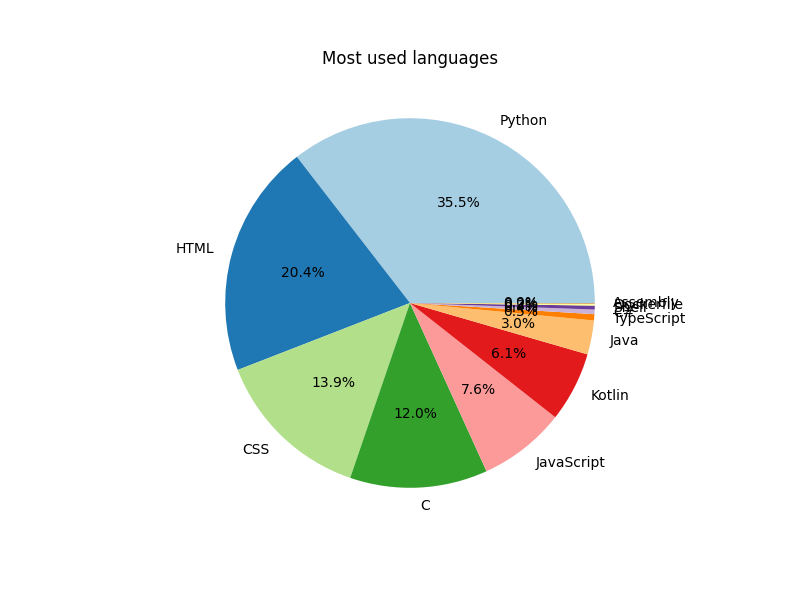

Hi there 👋 my name's Quentin or @loufi84. I'm from Dijon, France.
I'm interested in computer engineering in general with a focus on Cyber Security (which is really new to me). I also like Web and mobile applications.
I have a particular interest for Open Source development.
I am currently learning Software Engineering at Holberton School in Dijon.

# 🖥️ I know the bases of

# 🚀 My projects
For Holberton School I made those interesting projects :
- <a href="https://github.com/loufi84/holbertonschool-printf" target="blank"><strong>printf:</a></strong> A simple implementation of a printf function in C
- <a href="https://github.com/loufi84/holbertonschool-simple_shell" target="blank"><strong>Simple Shell:</a></strong> A simple Unix-style Shell containing basic builtins and calls to OS functions
- <a href="https://github.com/loufi84/holbertonschool-hbnb" target="blank"><strong>HBnB Evolution:</a></strong> A basic clone of AirBnB, used to understand diagrams, back-end, front-end and database management
Find all my projects <a href="https://github.com/loufi84?tab=repositories" target="blank">here</a>

# 🏅 My certifications
During my scholarship, I obtained the following IBM certifications :
- Introduction to Open Source
- AGILE development
- SQL and relational databases
- Project management fundamentals

You can see thoses certificates <a href="https://github.com/loufi84/holbertonschool-france-certificates-ibm" target="blank">here</a>

# 📬 How to reach me
<a href="https://www.linkedin.com/in/quentin-lataste-b5a359193/" target="blank">Linkedin</a>

<h1>📚 My blog posts</h1>
<a href="https://medium.com/@quentin.lataste" target="blank">
Some articles here
</a>

# My Stats

# Most used languages
Here are the languages I used:
### Languages used

- **C**: 168065 lines
- **Python**: 117082 lines
- **Kotlin**: 37885 lines
- **Java**: 10119 lines
- **C#**: 5583 lines
- **Shell**: 3466 lines
- **HTML**: 951 lines
- **Assembly**: 599 lines
<!-- LANGUAGES -->
<!---
loufi84/loufi84 is a ✨ special ✨ repository because its `README.md` (this file) appears on your GitHub profile.
You can click the Preview link to take a look at your changes.
--->
